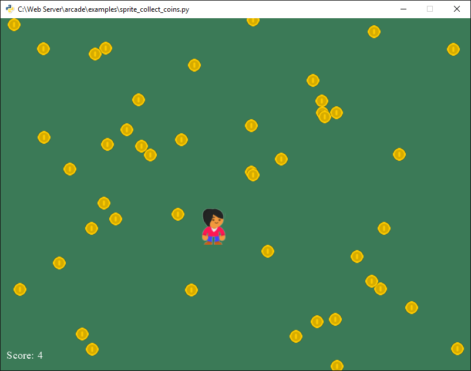
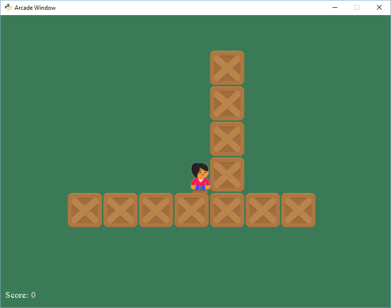
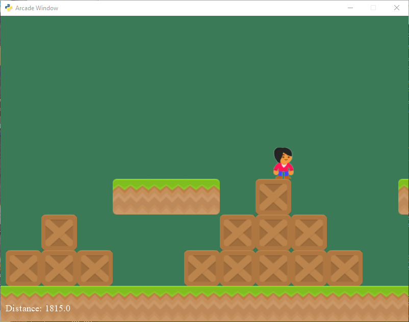
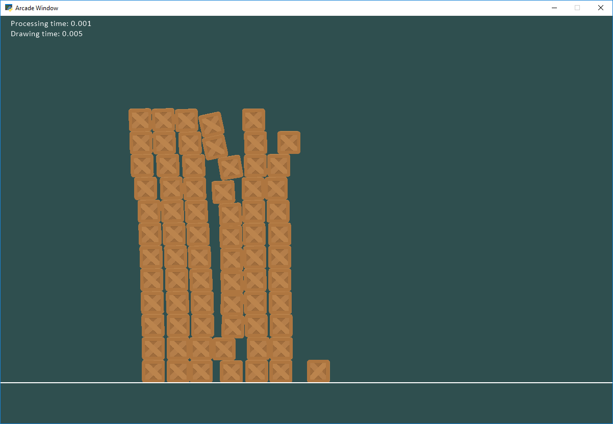

# Easy 2D Game Creation With Python And Arcade

[Python](https://opensource.com/resources/python) is a outstanding language for 
people learning. In addition Python is perfect for anyone wanting to 
"get stuff done" and not spend heaps of time on boilerplate code.
[Arcade](http://arcade.academy) is a Python library for 
creating 2D video games. It is painless to get get started using, and very 
capable as you gain experience. This article will show you how to use Python
and Arcade to program video games.

I started development on Arcade after teaching students using
the [PyGame](https://www.pygame.org) library. I taught using PyGame
for almost 10 years in person and 
developed the on-line site [ProgramArcadeGames.com](http://ProgramArcadeGames.com)
for learning to program. PyGame is great, but eventually
I felt like I was wasting time having to cover for 
[bugs that were never fixed](https://stackoverflow.com/questions/10148479/artifacts-when-drawing-primitives-with-pygame).
I worried about teaching things like the [event loop](https://www.pygame.org/docs/tut/tom_games2.html)
which was no longer the way we code. I had a
[whole section](http://programarcadegames.com/index.php?chapter=introduction_to_graphics&lang=en#section_5_1)
where I explained why the y-coordinates were reversed. 
I didn't hold a lot of hope for the future as PyGame was seldom updated, 
and it is based on
an old [SDL 1 ](https://www.libsdl.org/download-1.2.php)
library, rather than something like more modern like OpenGL.

I wanted a library that was easier to use, more powerful, and used some of the 
new features of Python 3 like decorators and type-hinting. Arcade is it.
And this is how to get started.

## Installation

Arcade, like many other packages, is available via 
[PyPi](https://pypi.python.org/pypi). That means you can install Arcade using the 
`pip` command. 
(Or the [pipenv](https://opensource.com/article/18/2/why-python-devs-should-use-pipenv) command.)
If you already have Python installed, you can likely just open
up a command prompt on Windows and type:

`pip install aracde`

Or on MacOS and Linux type:

`pip3 install arcade`

For more detailed installation instructions you can refer to the 
[Arcade installation documentation](http://arcade.academy/installation.html).

## Simple Drawing

You can open a window and create simple drawings with just a few lines of code.
Let's create an example that draws a smiley face like the figure below:


The script below shows how you can use 
[Arcade's drawing commands](http://arcade.academy/quick_index.html#drawing-module)
to do this. Note that you don't need to know how to use "classes"
or even define "functions." Programming with quick visual feedback is great 
for anyone who wants to start learning to program.

```python
import arcade

# Set constants for the screen size
SCREEN_WIDTH = 600
SCREEN_HEIGHT = 600

# Open the window. Set the window title and dimensions (width and height)
arcade.open_window(SCREEN_WIDTH, SCREEN_HEIGHT, "Drawing Example")

# Set the background color to white.
# For a list of named colors see:
# https://pythonhosted.org/arcade/arcade.color.html
# Colors can also be specified in (red, green, blue) format and
# (red, green, blue, alpha) format.
arcade.set_background_color(arcade.color.WHITE)

# Start the render process. This must be done before any drawing commands.
arcade.start_render()

# Draw the face
x = 300
y = 300
radius = 200
arcade.draw_circle_filled(x, y, radius, arcade.color.YELLOW)

# Draw the right eye
x = 370
y = 350
radius = 20
arcade.draw_circle_filled(x, y, radius, arcade.color.BLACK)

# Draw the left eye
x = 230
y = 350
radius = 20
arcade.draw_circle_filled(x, y, radius, arcade.color.BLACK)

# Draw the smile
x = 300
y = 280
width = 120
height = 100
start_angle = 190
end_angle = 350
arcade.draw_arc_outline(x, y, width, height, arcade.color.BLACK, start_angle, end_angle, 10)

# Finish drawing and display the result
arcade.finish_render()

# Keep the window open until the user hits the 'close' button
arcade.run()
```

## Using Functions

Of course, writing code in the global context isn't good form. Thankfully it
is easy to use improve your program by using functions. Here we can
see an example of a drawing a pine tree at a specific (x, y) location using a function:

```python
def draw_pine_tree(x, y):
    """ This function draws a pine tree at the specified location. """
    
    # Draw the triangle on top of the trunk.
    # We need three x, y points for the triangle.
    arcade.draw_triangle_filled(x + 40, y,       # Point 1
                                x, y - 100,      # Point 2
                                x + 80, y - 100, # Point 3
                                arcade.color.DARK_GREEN)

    # Draw the trunk
    arcade.draw_lrtb_rectangle_filled(x + 30, x + 50, y - 100, y - 140,
                                      arcade.color.DARK_BROWN)
```

For the full example see [drawing with functions](http://arcade.academy/examples/drawing_with_functions.html).


The more experienced reader will know that modern graphics programs first load
drawing information onto the graphics card, and then ask the graphics
card to draw it later as a batch. 
[Arcade supports this as well](http://arcade.academy/examples/shape_list_demo.html).
Drawing 10,000 rectangles individually takes about 0.800 seconds. Drawing them
as a batch takes less that 0.001 seconds.

## The Window Class

Larger programs will typically derive from the
[Window](http://arcade.academy/arcade.html#arcade.application.Window) class, or 
[use decorators](http://arcade.academy/examples/decorator_drawing_example.html#decorator-drawing-example).
This allows a programmer to write code to handle drawing,
updating, and handling input from the user. A template for a starting a
`Window` based program is below.

```python
import arcade

SCREEN_WIDTH = 800
SCREEN_HEIGHT = 600


class MyGame(arcade.Window):
    """ Main application class. """

    def __init__(self, width, height):
        super().__init__(width, height)

        arcade.set_background_color(arcade.color.AMAZON)

    def setup(self):
        # Set up your game here
        pass

    def on_draw(self):
        """ Render the screen. """
        arcade.start_render()
        # Your drawing code goes here

    def update(self, delta_time):
        """ All the logic to move, and the game logic goes here. """
        pass


def main():
    game = MyGame(SCREEN_WIDTH, SCREEN_HEIGHT)
    game.setup()
    arcade.run()


if __name__ == "__main__":
    main()
```

The `Window` class has several methods that your programs can override to provide
functionality to the program. Here are some of the most commonly used ones:

* `on_draw`: All the code to draw the screen goes here.
* `update`: All the code to move your items and perform game logic goes here. This is called about 60 times per second.
* `on_key_press`: Handle events when a key is pressed, such as giving a player a speed.
* `on_key_release`: Handle when a key is released, here you might stop a player from moving.
* `on_mouse_motion`: This is called every time the mouse moves.
* `on_mouse_press`: Called when a mouse button is pressed.
* `set_viewport`: This function is used in scrolling games, when you have a world
  much larger than what can be seen on one screen. Calling `set_viewport` allows
  a programmer to set what part of that world is currently visible.

## Sprites

[Sprites](https://en.wikipedia.org/wiki/Sprite_(computer_graphics)) are an easy 
way to create a 2D bitmapped object in Arcade. Arcade
has methods that make it easy to draw, move, and animate sprites. You can also
easily use sprites to detect collisions between objects. 

### Creating a Sprite

It is simple to create an instance of
Arcade's [Sprite](http://arcade.academy/arcade.html#arcade.sprite.Sprite) 
class out of a graphic. A programmer only needs the file name 
of an image to base the sprite
off of, and optionally a number to scale the image up or down. For example:
```python
SPRITE_SCALING_COIN = 0.2

coin = arcade.Sprite("coin_01.png", SPRITE_SCALING_COIN)
```

This code will create a sprite using the image stored in `coin_01.png`. The 
image will be scaled down to 20% of its original height and width.



Sprites are normally organized into lists. These lists make it easier to manage
the sprites. Sprites in a list will use OpenGL to batch-draw the sprites as a group.
The code below sets up a game with a player, and a bunch of coins for the player
to collect. We use two lists, one for the player and one for the coins.


```python
def setup(self):
    """ Set up the game and initialize the variables. """

    # Create the sprite lists
    self.player_list = arcade.SpriteList()
    self.coin_list = arcade.SpriteList()

    # Score
    self.score = 0

    # Set up the player
    # Character image from kenney.nl
    self.player_sprite = arcade.Sprite("images/character.png", SPRITE_SCALING_PLAYER)
    self.player_sprite.center_x = 50 # Starting position
    self.player_sprite.center_y = 50
    self.player_list.append(self.player_sprite)

    # Create the coins
    for i in range(COIN_COUNT):

        # Create the coin instance
        # Coin image from kenney.nl
        coin = arcade.Sprite("images/coin_01.png", SPRITE_SCALING_COIN)

        # Position the coin
        coin.center_x = random.randrange(SCREEN_WIDTH)
        coin.center_y = random.randrange(SCREEN_HEIGHT)

        # Add the coin to the lists
        self.coin_list.append(coin)
```

We can easily draw all the coins in the coin lists:

```python
def on_draw(self):
    """ Draw everything """
    arcade.start_render()
    self.coin_list.draw()
    self.player_list.draw()
```

### Detecting Sprite Collisions

The function `check_for_collision_with_list` allows us to see if a sprite runs
into another sprite in a list. We can use this to see all the coins the player
sprite is in contact with. Using a simple `for` loop, we can get rid of the coin
from the game and increase our score.

```python
def update(self, delta_time):
    # Generate a list of all coin sprites that collided with the player.
    coins_hit_list = arcade.check_for_collision_with_list(self.player_sprite, self.coin_list)

    # Loop through each colliding sprite, remove it, and add to the score.
    for coin in coins_hit_list:
        coin.kill()
        self.score += 1
```

For the full example, see [collect_coins.py](http://arcade.academy/examples/sprite_collect_coins.html).

## Game Physics

Many games include some kind of physics. The simplest are top-down
programs that prevent the player from walking through walls. Platformers
add more complexity with gravity, and platforms that move. Some games
use a full 2D physics engine with mass, friction, springs and more.

### Top-down Games



For simple top-down based games, an Arcade program needs a list of walls
that the player (or anything else) can't move through. 
I usually call this `wall_list`. Then a physics
engine is created in the `Window` class's setup code with:

```python
self.physics_engine = arcade.PhysicsEngineSimple(self.player_sprite, self.wall_list)
```

The `player_sprite` is given a movement vector with its two attributes 
`change_x` and `change_y`. A simple example of doing this would be
to have the player move with the keyboard. For example, this might be
in the custom child of the `Window` class:

```python
MOVEMENT_SPEED = 5

def on_key_press(self, key, modifiers):
    """Called whenever a key is pressed. """

    if key == arcade.key.UP:
        self.player_sprite.change_y = MOVEMENT_SPEED
    elif key == arcade.key.DOWN:
        self.player_sprite.change_y = -MOVEMENT_SPEED
    elif key == arcade.key.LEFT:
        self.player_sprite.change_x = -MOVEMENT_SPEED
    elif key == arcade.key.RIGHT:
        self.player_sprite.change_x = MOVEMENT_SPEED

def on_key_release(self, key, modifiers):
    """Called when the user releases a key. """

    if key == arcade.key.UP or key == arcade.key.DOWN:
        self.player_sprite.change_y = 0
    elif key == arcade.key.LEFT or key == arcade.key.RIGHT:
        self.player_sprite.change_x = 0
```

While that code sets the player's speed, it doesn't move the player. In
the `update` method of the `Window` class, calling `physics_engine.update()`
will move the player, but not through walls.

```python
def update(self, delta_time):
    """ Movement and game logic """

    # Call update on all sprites (The sprites don't do much in this
    # example though.)
    self.physics_engine.update()
```

For a full example see [sprite_move_walls.py](http://arcade.academy/examples/sprite_move_walls.html)

### Platformers



Moving to a side view platformer is rather easy. A programmer just needs to 
switch the physics engine to `PhysicsEnginePlatformer` and add in the 
gravity constant.

```python
self.physics_engine = arcade.PhysicsEnginePlatformer(self.player_sprite,
                                                     self.wall_list, 
                                                     gravity_constant=GRAVITY)
```

You can use a program like [Tiled](http://www.mapeditor.org/) to lay the
tiles/blocks that make up your level.

For an example see [sprite_tiled_map.py](http://arcade.academy/examples/sprite_tiled_map.html)

### 2D Physics with PyMunk



[PyMunk Platformer](http://arcade.academy/examples/pymunk_platformer.html)

## Learn by Example

One of the best ways to learn is by example. The Arcade library has a long
list of [example programs](http://arcade.academy/examples/index.html) that a person
can draw on to create games. These examples each show a game concept that students
have asked for in my classes or on-line over the years.

It is easy to run any of these demos once Arcade has been installed. Each of
the samples has a comment at the beginning of the program with a command
you can type on the command-line to run the sample, for example: 

`python -m arcade.examples.sprite_moving_platforms`

## Summary

Arcade lets you start programming graphics and games with straight-forward
and easy to understand code. Many new programmers have created
[great games](http://arcade.academy/sample_games.html) in just a few months
time. Give it a try!

