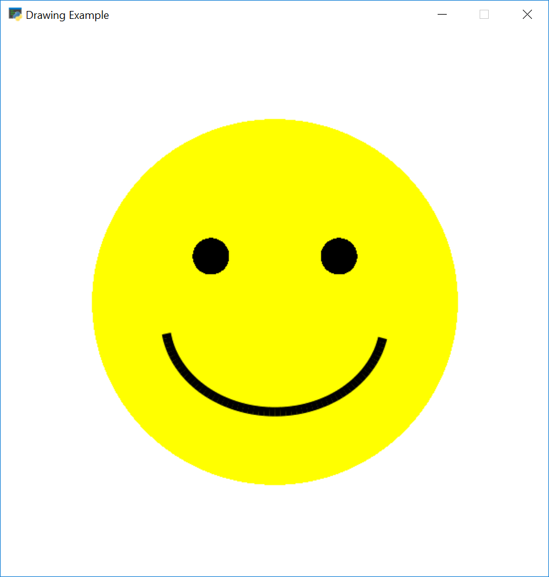
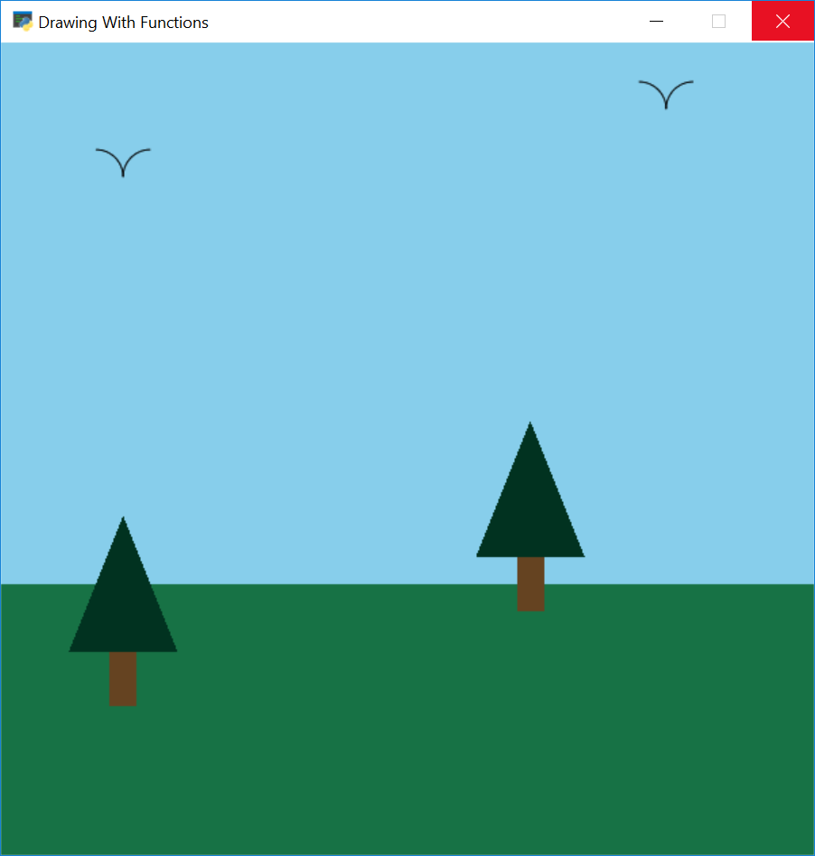

Easy 2D Game Creation With Python And Arcade
===

[Python](https://opensource.com/resources/python) is a great language for 
people learning to program. It is also a great 
language for anyone just wanting to "get stuff done" without spending a lot of 
time on language or framework overhead.

[Arcade](http://arcade.academy) is a Python library for 
creating 2D video games. It is easy to get get started
with it, and is a great choice for new programmers or people who are looking
for a game framework that doesn't take a long time to learn.

I started development on Arcade after teaching students using
the [PyGame](https://www.pygame.org) library for almost 10 years in person and 
[on-line](http://ProgramArcadeGames.com). PyGame is great, but eventually
I felt like I was wasting time having to cover for 
[bugs that were never fixed](https://stackoverflow.com/questions/10148479/artifacts-when-drawing-primitives-with-pygame).
I worried about teaching things like the [event loop](https://www.pygame.org/docs/tut/tom_games2.html)
which was no longer the way we code. I had a
[whole section](http://programarcadegames.com/index.php?chapter=introduction_to_graphics&lang=en#section_5_1)
where I explained why the y-coordinates were reversed. 
I didn't hold a lot of hope for the future as PyGame was seldom updated, 
and it is based on
an old [SDL 1 ](https://www.libsdl.org/download-1.2.php)
library, rather than something like more modern like OpenGL.

I wanted a library that was easier to use, more powerful, and used some of the 
new features of Python 3. Arcade is it.

Installation
---

Arcade, like many other packages, is available via 
[PyPi](https://pypi.python.org/pypi). That means you can install Arcade using the 
`pip` command. 
(Or the [pipenv](https://opensource.com/article/18/2/why-python-devs-should-use-pipenv) command.)
If you already have Python installed, you can likely just open
up a command prompt on Windows and type:

`pip install aracde`

Or on MacOS and Linux type:

`pip3 install arcade`

For more detailed installation instructions you can refer to the 
[Arcade installation documentation](http://arcade.academy/installation.html).

Simple Drawing
---

You can open a window and create simple drawings with just a few lines of code.
Let's create an example that draws a smiley face:



The script below shows how you can use 
[Arcade's drawing commands](http://arcade.academy/quick_index.html#drawing-module)
to draw the smiley face. Note that you don't need to know how to use "classes"
or even define "functions." This great for anyone who wants to start programming
by doing something visual.

```python
import arcade

SCREEN_WIDTH = 600
SCREEN_HEIGHT = 600

# Open the window. Set the window title and dimensions (width and height)
arcade.open_window(SCREEN_WIDTH, SCREEN_HEIGHT, "Drawing Example")

# Set the background color to white
# For a list of named colors see
# https://pythonhosted.org/arcade/arcade.color.html
# Colors can also be specified in (red, green, blue) format and
# (red, green, blue, alpha) format.
arcade.set_background_color(arcade.color.WHITE)

# Start the render process. This must be done before any drawing commands.
arcade.start_render()

# Draw the face
x = 300
y = 300
radius = 200
arcade.draw_circle_filled(x, y, radius, arcade.color.YELLOW)

# Draw the right eye
x = 370
y = 350
radius = 20
arcade.draw_circle_filled(x, y, radius, arcade.color.BLACK)

# Draw the left eye
x = 230
y = 350
radius = 20
arcade.draw_circle_filled(x, y, radius, arcade.color.BLACK)

# Draw the smile
x = 300
y = 280
width = 120
height = 100
start_angle = 190
end_angle = 350
arcade.draw_arc_outline(x, y, width, height, arcade.color.BLACK, start_angle, end_angle, 10)

# Finish drawing and display the result
arcade.finish_render()

# Keep the window open until the user hits the 'close' button
arcade.run()
```

Using Functions
---

Of course, writing code in the global context isn't good form. Thankfully it
is easy to use learn about using functions with Python and Arcade. Here we can
see an example of a student drawing a pine tree using a function and parameters.

```python
def draw_pine_tree(x, y):
    """
    This function draws a pine tree at the specified location.
    """
    # Draw the triangle on top of the trunk.
    # # We need three x, y points for the triangle.
    arcade.draw_triangle_filled(x + 40, y,       # Point 1
                                x, y - 100,      # Point 2
                                x + 80, y - 100, # Point 3
                                arcade.color.DARK_GREEN)

    # Draw the trunk
    arcade.draw_lrtb_rectangle_filled(x + 30, x + 50, y - 100, y - 140,
                                      arcade.color.DARK_BROWN)
```



For the full example see [drawing with functions](http://arcade.academy/examples/drawing_with_functions.html).

The more experience reader will know that modern graphs programs first load
drawing information onto the graphics card, and then asks the graphics
card to draw it. 
[Arcade supports this as well](http://arcade.academy/examples/shape_list_demo.html).

Using Sprites
---

Platformers
---


Other Example Code
---

[Example Arcade Code](http://arcade.academy/examples/index.html)

Note how easy it is to run examples.
